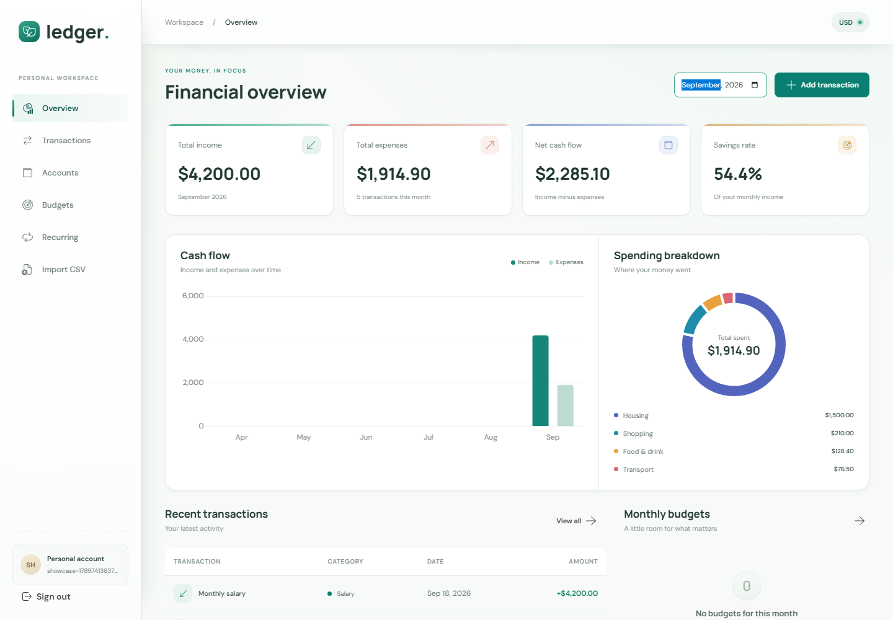
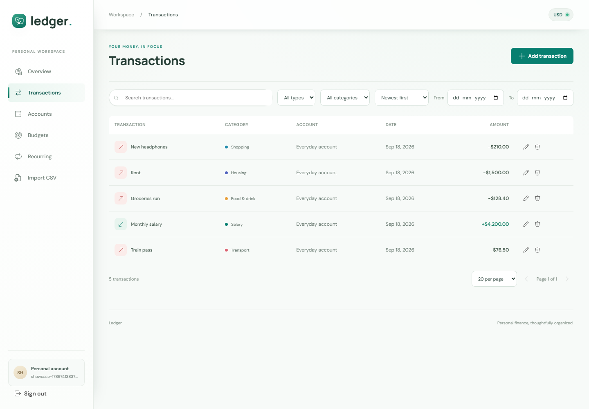
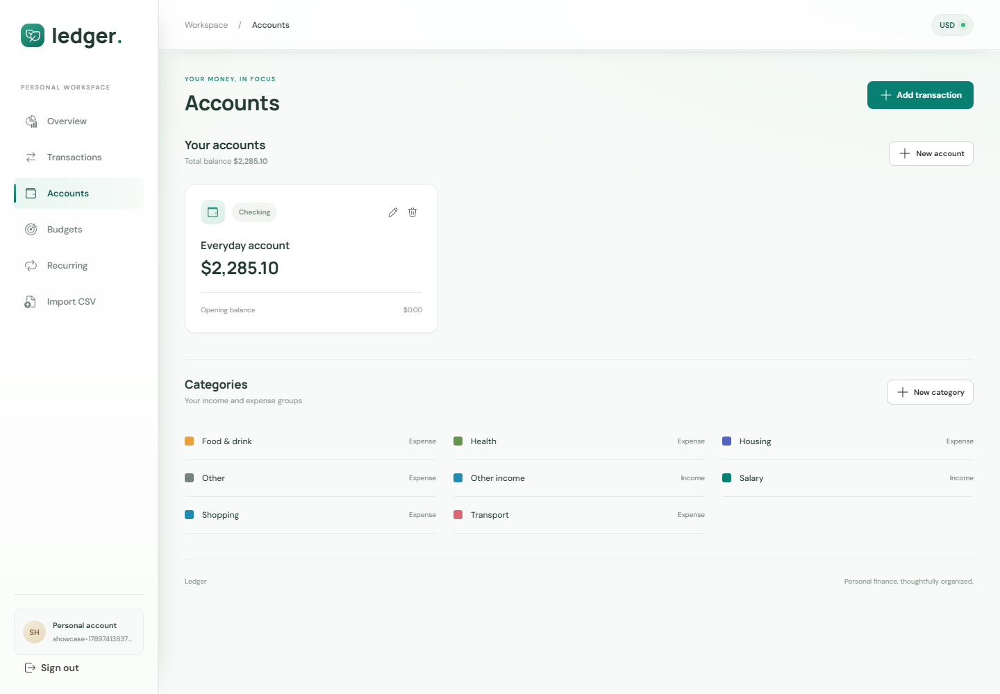
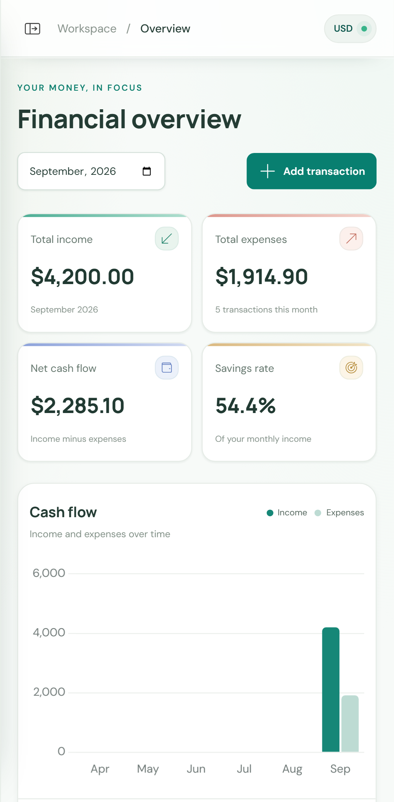
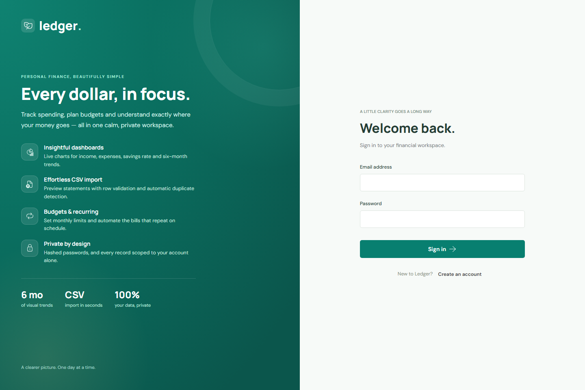
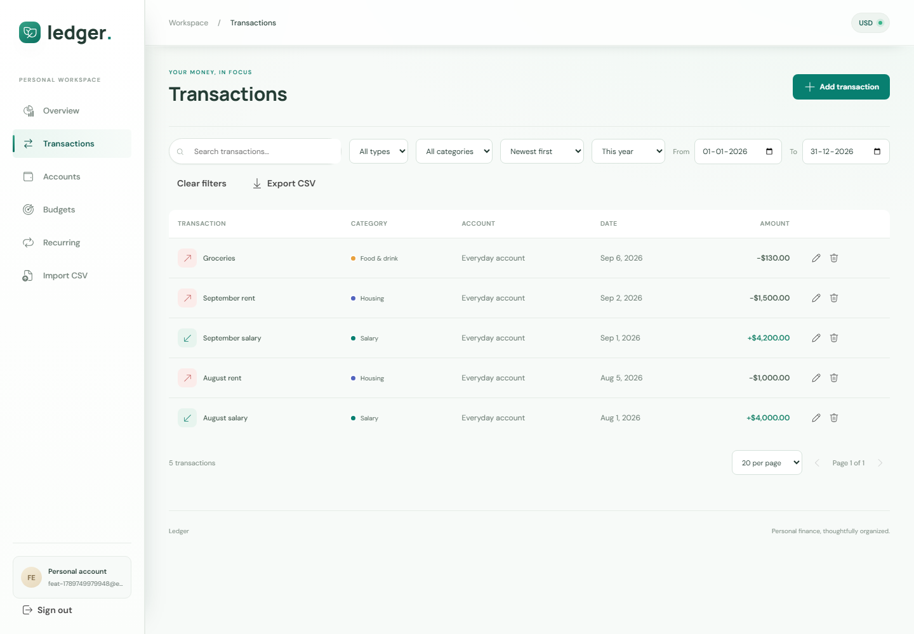
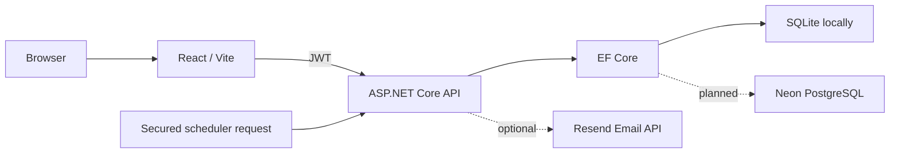
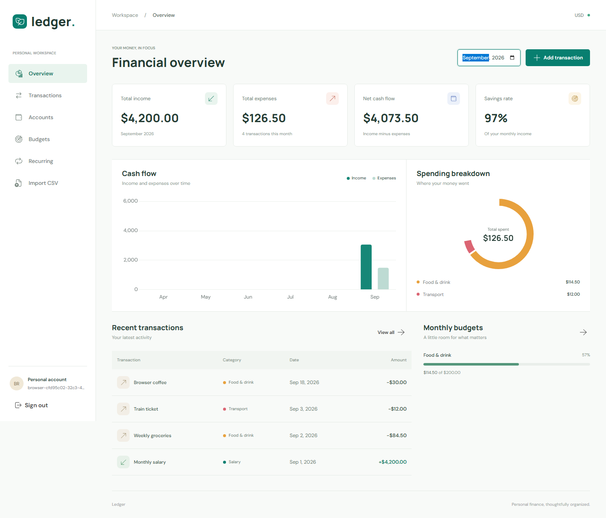
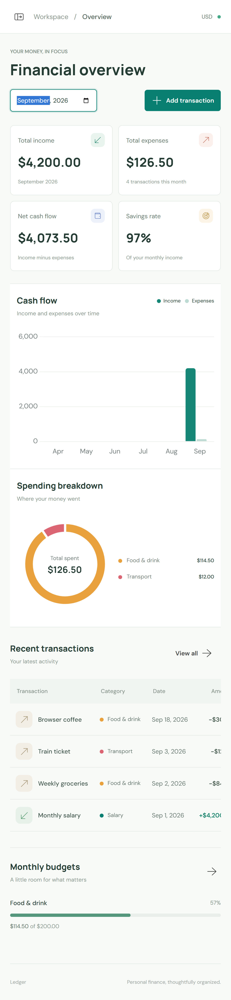

# Ledger

### Personal finance, thoughtfully organized.

Ledger is a full-stack personal finance workspace for tracking accounts, transactions, budgets, recurring payments, and CSV imports in one calm, focused interface.

**Live app:** [ledger-finance-analytics.vercel.app](https://ledger-finance-analytics.vercel.app)<br>
**API:** [ledger-api-m7qb.onrender.com](https://ledger-api-m7qb.onrender.com) | [Swagger UI](https://ledger-api-m7qb.onrender.com/swagger/index.html) | [Health](https://ledger-api-m7qb.onrender.com/health)

> Create a new account to explore the live app. No demo credentials or shared user data are seeded.



## What It Does

- **Financial dashboard** with income, expenses, net cash flow, savings rate, trends, and spending breakdowns
- **Account management** with balances, currencies, categories, and safe deletion rules
- **Transaction workflows** with filtering, sorting, pagination, search, CSV export, and duplicate detection
- **Budgets** with monthly limits, live spend tracking, progress indicators, and overspending states
- **Recurring transactions** with daily, weekly, monthly, and yearly schedules
- **CSV imports** with preview, validation, duplicate detection, idempotent confirmation, and import history
- **Secure authentication** with password hashing, JWT access tokens, rotating refresh sessions, HttpOnly cookies, rate limiting, and origin validation

## Product Tour

| Dashboard | Transactions |
|:---:|:---:|
|  |  |

| Accounts | Mobile experience |
|:---:|:---:|
|  |  |

| Sign in | Import and review |
|:---:|:---:|
|  |  |

## Engineering Highlights

- Layered ASP.NET Core architecture separating API, application rules, domain entities, infrastructure, and tests
- EF Core migrations for PostgreSQL in production and isolated SQLite databases for local development and tests
- User-scoped EF query filters and composite foreign keys to prevent cross-user data access
- Integer minor-unit storage for reliable monetary calculations
- Idempotent recurring-payment processing safe for scheduled retries
- Same-origin Vercel API rewrites so refresh cookies remain first-party
- Docker multi-stage build deployed to Render with automatic production migrations
- GitHub Actions for backend/frontend CI and scheduled recurring-payment processing

## Technology

| Area | Stack |
|---|---|
| Frontend | React 19, TypeScript, Vite, Fluent UI, TanStack Query, React Hook Form, Zod, Chart.js |
| Backend | ASP.NET Core 10, C#, REST APIs, Swagger, Serilog |
| Data | EF Core, PostgreSQL via Npgsql, SQLite for local development and tests |
| Security | JWT, password hashing, HttpOnly refresh cookies, CORS, rate limiting |
| Delivery | Docker, Render, Vercel, Neon, GitHub Actions |

## Run Locally

### Requirements

- .NET 10 SDK
- Node.js 24 LTS

From the repository root:

```powershell
dotnet restore FinanceAnalytics.sln
npm --prefix frontend ci
```

Start the API in one terminal:

```powershell
dotnet run --project backend/Finance.Api -- --environment Development --urls http://localhost:5080
```

Start the frontend in another:

```powershell
npm --prefix frontend run dev
```

Open [localhost:5173](http://localhost:5173). The Vite proxy forwards `/api` and `/health` to the API. Local development creates `backend/Finance.Api/finance.db` automatically; it is ignored by Git.

## Verify

```powershell
dotnet test FinanceAnalytics.sln
npm --prefix frontend run lint
npm --prefix frontend test
npm --prefix frontend run build
```

The backend test suite uses temporary SQLite databases and covers authentication, ownership isolation, dashboard totals, validation, imports, budgets, and recurring-payment idempotency. Frontend tests cover authentication and form validation.

## Deployment

The production topology is:

```text
Vercel (React SPA) -> Render (ASP.NET Core API) -> Neon (PostgreSQL)
                                                                            ^
                                                            GitHub Actions scheduler
```

Deployment configuration is checked in:

- [backend/Dockerfile](backend/Dockerfile) - multi-stage .NET image
- [render.yaml](render.yaml) - Render service definition
- [frontend/vercel.json](frontend/vercel.json) - SPA fallback and same-origin API rewrite
- [.github/workflows/ci.yml](.github/workflows/ci.yml) - build, lint, and test checks
- [.github/workflows/recurring.yml](.github/workflows/recurring.yml) - hourly recurring-payment processing

Production secrets belong in the hosting dashboards, never in Git:

```text
ASPNETCORE_ENVIRONMENT=Production
ConnectionStrings__DefaultConnection=<Neon Npgsql connection string>
Jwt__Key=<32+ random characters>
Jwt__Issuer=FinanceAnalyticsApi
Jwt__Audience=FinanceAnalyticsClient
Cors__AllowedOrigins=https://<your-vercel-domain>
Scheduler__Secret=<32+ random characters>
```

The repository includes [backend/.env.example](backend/.env.example) and [frontend/.env.example](frontend/.env.example) as safe templates. Never commit `.env.local`, database files, API keys, or passwords.

## Repository Layout

```text
backend/
    Finance.Api/             HTTP API and startup configuration
    Finance.Application/     DTOs, interfaces, and business rules
    Finance.Domain/          Domain entities
    Finance.Infrastructure/ EF Core data access and services
    Finance.Tests/           API and integration tests
frontend/
    src/                     React application and feature modules
    e2e/                     Playwright browser tests
docs/screenshots/          Product screenshots
```

## License

This project is a portfolio application created for demonstration and learning.

React/TypeScript personal finance workspace with an ASP.NET Core 10 API, EF Core, Fluent UI, TanStack Query, React Hook Form, Zod, and Chart.js. Local development uses SQLite; no cloud account or paid resource is required.

## Local Setup

Install .NET 10 SDK and Node.js 24 LTS. From the repository root:

```powershell
dotnet restore FinanceAnalytics.sln
npm --prefix frontend ci
```

Start the API:

```powershell
dotnet run --project backend/Finance.Api -- --environment Development --urls http://localhost:5080
```

In another terminal, start the frontend:

```powershell
npm --prefix frontend run dev
```

App: http://localhost:5173. Swagger: http://localhost:5080/swagger. Database health: http://localhost:5080/health.

Vite proxies `/api` and `/health` to the API. Leave `VITE_API_BASE_URL` unset locally and use `localhost` consistently. Ports 5173 and 5080 must be available. SQLite is created automatically at `backend/Finance.Api/finance.db`; records survive restarts. Database files are ignored by Git. Local startup uses `EnsureCreated`, not migrations; back up data before future schema changes.

Register with your own email and a password of at least 12 characters. Registration creates an Everyday account and starter categories. No shared demo credentials are seeded. Download the sample from **Import CSV**, preview it, then confirm. Select September 2026 on the dashboard for the sample period.

## Implemented Workflows

- Registration, login, rotating refresh sessions, and logout. ASP.NET Identity hashes passwords; JWT access tokens stay in memory and refresh tokens use HttpOnly cookies.
- Accounts: create, edit, view balances, and delete unused accounts. Categories: create with type and color.
- Transactions: create, edit, delete, paginate, filter by date/type/category/search, and sort.
- Dashboard: income, expenses, net cash flow, savings rate, six-month trends, spending breakdown, and recent transactions.
- Budgets: create, edit, delete, monitor progress and overspending.
- CSV: preview, row validation, duplicate detection, confirmation, and import history.
- Recurring rules: daily, weekly, monthly, yearly, edit, pause/resume, and protected idempotent processing.
- Swagger, database health checks, Serilog console logs, and optional Resend welcome email.

All accounts use the user's reporting currency; exchange-rate conversion is not implemented. Amounts are stored as integer minor units. Identical account/category/type/amount/description/date fingerprints are rejected as duplicates, including manual entries.

## CSV Import

```csv
date,description,amount,type,category
2026-09-01,Monthly salary,4200.00,Income,Salary
2026-09-02,Coffee,4.50,Expense,Food & drink
```

Use a non-empty `.csv` file up to 2,000,000 bytes and 2,000 rows. Headers must be unique and include the five columns above. Dates use `yyyy-MM-dd`. Amounts are positive, with at most two decimal places, without currency symbols or thousands separators. Categories must already exist for the user and match the transaction type.

Original files are never stored. One parsed preview per user is cached in memory for 15 minutes and replaced by the next upload. Restarting the API discards previews. Confirmation rechecks duplicates and inserts valid entries atomically; repeating confirmation of the cached preview returns the previous result.

## Local Recurring Processing

Before starting the API, set a random scheduler secret in its terminal:

```powershell
$env:Scheduler__Secret = [Convert]::ToBase64String([System.Security.Cryptography.RandomNumberGenerator]::GetBytes(48))
```

Call the endpoint from a terminal with the same environment variable securely configured:

```powershell
Invoke-RestMethod -Method Post -Uri http://localhost:5080/api/jobs/process-recurring -Headers @{ 'X-Scheduler-Secret' = $env:Scheduler__Secret }
```

Do not print or commit the secret. There is no automatic local timer. Processing uses the UTC date and handles up to 200 due rules and 366 occurrences per rule per request. Repeated calls drain a backlog without duplicating occurrences. Monthly rules preserve their day-of-month anchor.

## Verification

Run from the repository root:

```powershell
dotnet test FinanceAnalytics.sln
npm --prefix frontend run lint
npm --prefix frontend test
npm --prefix frontend run build
```

Backend tests use temporary isolated SQLite databases and cover ownership, authentication, dashboard totals, validation, imports, and recurring idempotency. Frontend tests cover form validation and authentication UI.

Browser tests exist but further Playwright testing is currently paused at the user's request. The last mobile run found Transactions-page horizontal overflow (506px content on a 412px viewport); mobile sign-out and the final dialog changes are not fully verified. Do not treat the complete browser suite as passing.

To resume browser verification later:

```powershell
Push-Location frontend
npx playwright install chromium
Pop-Location
npm --prefix frontend run test:e2e
```

The suite starts servers when needed or reuses running local servers and creates unique test users. Failed traces are retained under `frontend/test-results/`. Dashboard images are generated under [docs/screenshots](docs/screenshots); existing images are not proof of complete browser validation.

## Architecture



The backend separates API controllers, application DTOs/rules, domain entities, and infrastructure services. EF query filters scope owned records to the authenticated user; composite foreign keys prevent cross-user account/category references. Authentication/session management and the secret-protected cross-user scheduler intentionally bypass tenant filters.

## Configuration

No secrets are required for basic local use. Backend environment variables:

| Variable | Purpose |
| --- | --- |
| `ASPNETCORE_ENVIRONMENT=Production` | Selects production behavior and PostgreSQL migrations |
| `ConnectionStrings__DefaultConnection` | SQLite connection string locally or Npgsql connection string |
| `Database__Provider=Postgres` | Opt into PostgreSQL in development |
| `Jwt__Issuer`, `Jwt__Audience` | Defaults: FinanceAnalyticsApi, FinanceAnalyticsClient |
| `Jwt__Key` | At least 32 bytes; generated on startup locally if unset |
| `Cors__AllowedOrigins` | Comma-separated exact origins; defaults to http://localhost:5173 locally |
| `Scheduler__Secret` | Protects recurring processing |
| `Resend__ApiKey`, `Resend__From` | Optional welcome email; leave unset to disable |

JWT issuer, audience, signature, and expiry are validated. Authentication endpoints are rate-limited. Refresh/logout require a protection header and validate supplied origins. Production requires explicit database, JWT, CORS, and scheduler configuration. Refresh cookies are Secure outside Development/Testing. Local HTTP is for loopback development only; production requires HTTPS.

Never place secrets in `VITE_` variables, which are public build inputs. `.env` files, local configuration, databases, logs, dependencies, and build output are ignored. Live Resend delivery and PostgreSQL behavior have not been verified in this local phase.

## Deployment

The free-tier deployment uses **Neon PostgreSQL**, **Render**, **Vercel**, and **GitHub Actions**. Deployment files are already included: `backend/Dockerfile`, `render.yaml`, `frontend/vercel.json`, and the workflows under `.github/workflows/`.

1. Create a free Neon database and copy its pooled connection details into this Npgsql format: `Host=...;Database=...;Username=...;Password=...;SSL Mode=Require;Trust Server Certificate=true`.
2. Create a Render web service from the repository using `render.yaml`. Set the database, JWT, CORS, and scheduler variables from the Render dashboard. Production applies the checked-in EF migrations at startup.
3. Create a Vercel project with `frontend` as the root directory. Replace `<RENDER_API_URL>` in `frontend/vercel.json` with the Render HTTPS hostname, leave `VITE_API_BASE_URL` empty, and set `Cors__AllowedOrigins` to the Vercel URL.
4. Add the GitHub Actions repository secrets `API_BASE_URL` (the Render API URL) and `SCHEDULER_SECRET` (the same value as Render's `Scheduler__Secret`). The recurring workflow is hourly and can also be run manually.
5. Validate `https://<render-host>/health`, `https://<render-host>/swagger`, then use the Vercel app for signup, adding a transaction, and checking the dashboard.

The same-origin Vercel `/api` rewrite keeps refresh cookies first-party. Without it, browser third-party-cookie restrictions can prevent refresh sessions when the frontend and API use different sites. No demo credentials are seeded; use a new account during validation. Resolve the known mobile Transactions overflow before treating browser verification as complete.

## Screenshots



